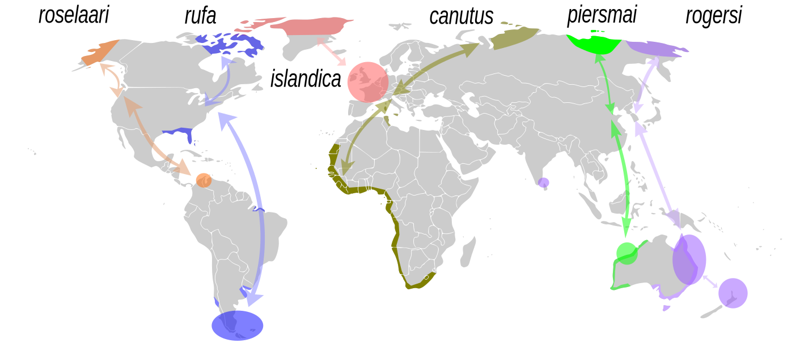
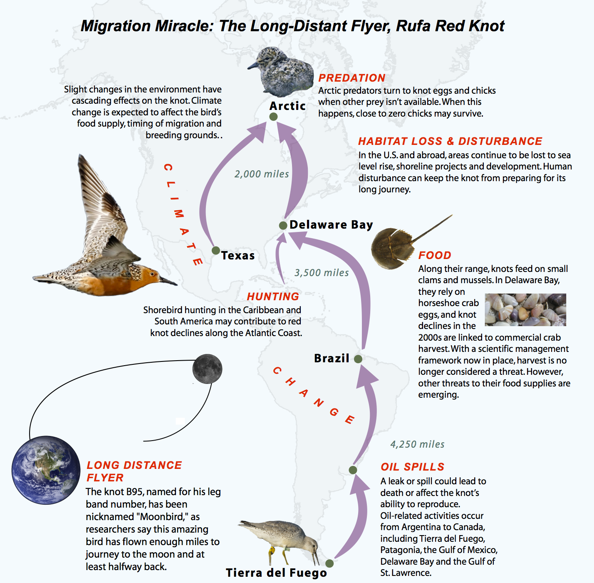
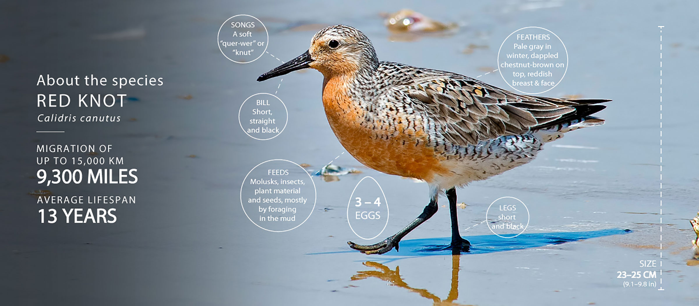

# Goal

1. Collect various ideas and resources to teach a group of children about

   1. Horseshoe crabs
   2. Red Knot (bird)
   3. Ecology related aspects of Horseshoe crabs and Red Knots

2. Make this document available to others for use and contribute ideas/thoughts.

## Age of children

- Primarily for kids above 3 years and upto 6 years
- but also collect resources for elder school going kids

## Geographical limitation

- primarily aimed at the ecology of eastern shore of USA (Delaware, New Jersey)
- but also collect educational resource information for Red Knots and Horseshoe crabs in other parts of the world

# Concepts to teach

- Red Knots travel to Delaware bay from very very far away
- Horseshoe crabs spawn in Delaware bay
- timing of spawning and Red Knots arrival is crucial to the Red Knots existence
- threats to Horseshoe crabs and Red Knots

	- RED KNOT
	- Some populations winter as far south as Tierra del Fuego, the southern tip of South America.
	- More than half of the Western hemisphere’s population of Red Knot may be in the Delaware Bay in May.
	- Red Knots may travel 20,000 miles round trip per year making non-stop flights of 2,000 miles or more.
	- More than 90% of their diet at the Delaware Bay consists of horseshoe crab eggs.
	- The weight they gain from horseshoe crab eggs allows them to make their final non-stop flight to their Arctic breeding grounds. 
	- It will also help sustain them during the initial nesting period until food becomes available there.

	- HORSESHOE CRABS
	- There are four species of horseshoe crab worldwide. Only one species (Limulus Polyphemus) lives in North America. The largest population is in the Delaware Bay.
	- Horseshoe crabs are not actually crabs. They are arthropods more closely related spiders and scorpions.
	- It takes about 9 years for a horseshoe crab to become sexually mature.
	- During spawning, a female horseshoe crab lays a cluster of about 4,000 eggs several times each night and may lay around 100,000 eggs each season.

	Reference:  
	Delaware Bay Ecology  
	https://dnrec.delaware.gov/fish-wildlife/conservation/shorebirds/bay-ecology/

	- RED KNOT
	- Weighing about as much as a D-size battery, Red Knots fly up to 15,000 km (9,300 miles) during their yearly migration between Arctic breeding grounds and wintering grounds farther south, which for some Red Knots is the southern tip of South America.
	- take a D-cell battery for the kids

	Reference:
	Red Knots
	https://whsrn.org/about-shorebirds/highlighted-species/red-knot/

# Educational Resources

1. Sea Grant Delaware

- lots of educational resources available (lesson plans/books/videos/coloring pages etc)
  
  URL: https://www.deseagrant.org/education  
  URL: https://www.deseagrant.org/education-resources
  

2. Publication in Nature

- What's killing the world's shorebirds?

reference

    What's killing the world's shorebirds?
    Published: 05 January 2017
    https://www.nature.com/articles/541016a

- copyrighted. need to buy a license to use

---

## Activity ideas

### Activity on the beach

- none for now since the school/s I am volunteering to teach, are far from Delaware Bay

### Activity in the classroom

#### Coloring Pages

Available online here from Sea Grant Delaware: [coloring page](https://www.deseagrant.org/coloring-pages/2020/10/3/red-knot).

Downloaded copy is available [here](./activities/DESG-CD-coloringsheet-redknot2.pdf).

#### Build models

Build a model of a Horseshoe crab. 
 
- Instructions are available [here](https://njseagrant.org/wp-content/uploads/2014/03/build_a_horseshoe_crab.pdf) 
- Downloaded copy is [here](./activities/NJ-seaGrant-build_a_horseshoe_crab.pdf)

#### Children game 1

- one group of children choose to play the role of Horseshoe Crabs
- one group of children choose to play the role of Red Knots

Items required:

- blue bedsheet which denotes the ocean
- table tennis balls or something similar which denote the horseshoe crab eggs
- heavy backpacks for kids (which are filled with rocks/weights)
- a lamp in the room which can change its light intensity to denote the arrival of summer
- inflatable globe/large map showing both the route and stopping points for the RedKnot and also the range of the Horseshoe Crab. Try to convey the immense distance the knot flies and why it needs to bulk up on specific food.
  - the larger the globe/map the better to show how far Red Knots travel

HORSESHOE CRABS

- a blue bedsheet is laid on the ground and it denotes the ocean where the Horseshoe crabs have to go stand/sit
- each kid has a number of table-tennis balls which are "eggs" they have to go the shoreline and lay

RED KNOTS

- this group of kids goes outside the class to mimic the long range migration route of the birds
- this group of kids may be given really heavy backpacks to mimic the massive weight gain the birds have to do before migrating

Goal:

- the horseshoe crabs all have to come to the edge of the blue bedsheet they are standing on (come to the shoreline) and deposit the balls (lay the eggs)
- the birds have to come and collect the eggs from the shoreline

Talking points:

- how do the birds co-ordinate their time of arrival with the spawning of eggs?

Other ideas/suggestions to incorporate:

- SB:
	
	It’s really hard for humans to conceive the large distances involved here.   
	Birds have to double their weight to fly nonstop so far.  
	Night and day flight without sleep.  

	Kids will be able to relate (hopefully) to some comparisons….  
		How far do we fly for vacations? 
		How far is it to California (or some other far away place kids can relate to)? 
		Can we imagine not sleeping for that long while flying?  

	Migration threats the Red knots have to overcome: hunger, hunters, storms etc.

	And weight gain and loss is also something kids can understand. 
		Perhaps have objects there with various weights.  
		Bring two bags of different weights, one with the weight knots are when they arrive and one with the weight after gorging on eggs for two weeks.
		Or fill a backpack with rocks and have a kid wear it to see what it feels like to double weight

	Point out how long Horseshoe Crabs have been on earth - they were here when dinosaurs roamed.

- GB:
	
	Another good point is the doubling of weight.  
	Not only  are the Red Knots unusual in that they can put on that much weight in that short of a time, but it is easy to relate to humans.   
	A red knot weighing around 150 g adding 8 g per day for two weeks, is roughly the equivalent of a 150 lb human gaining 8 lbs per day for two weeks.  

	A gallon of water is probably the easiest model for 8 lbs of body weight to obtain.

### Books

List of books to read either after the lesson OR if the kids are younger, make the book/s part of the lesson plan.

- Moonbird: A Year on the Wind with the Great Survivor B95 - https://a.co/d/bATO9Sl
- Crab Moon - https://a.co/d/j253cT8
- Horseshoe Crabs and Shorebirds: The Story of a Food Web - https://a.co/d/fN74yml
- High Tide for Horseshoe Crabs - https://a.co/d/iUV8sHA

## Posters

Posters which can be obtained (via buying/requesting/printing):

1. Tracking trouble in the Arctic

- copyrighted. need to buy a license to use

Availabe on the web [Tracking trouble in the Arctic](https://www.nature.com/news/polopoly_fs/7.41514!/file/541016abox.pdf)

reference

    Title: What's killing the world's shorebirds?
    Published Date: 05 January 2017
    URL: https://www.nature.com/articles/541016a

## Models of animals

### Red Knots

- Red Knot sculptures are TOO expensive to buy :(

### Horseshoe Crabs

- Horseshoe Crab models are available on Amazon for under 10$ (as of April 2024)
	- https://a.co/d/e66vWne
- Ragan Callahan art: https://www.etsy.com/shop/CapeCustomArt
- $650 life sized model available [here](https://www.horseshoecrab.org/store/model.html)

## Photos/images

### Red Knot migration (worldwide)

Available here on the internet: [wikipedia image](https://commons.wikimedia.org/w/index.php?curid=6799705)

- no license required to use, public domain

### Migration Miracle - USFWS Tweet

	@USFWSNortheast
	Tweeted on: April 7, 2014
	URL:https://twitter.com/USFWSNortheast/status/453322369419837440
 
- copytright license unknown

### WHSRN infographic

- need license to use

Available here on the web [whsrn infographic](https://whsrn.org/wp-content/uploads/2019/02/rekn_banner_fullwidth.jpg)

reference

    Title: Red Knot
    Published Date: unknown
    URL: https://whsrn.org/about-shorebirds/highlighted-species/red-knot/

## Videos

Videos to show to kids during the lesson or after the lesson.

SHORT VIDEOS

### 15 Second Science: Horseshoe Crab Eggs

- quick exlplanation of horseshoe crab eggs
- image of horseshoe crabs
- image of spawning in the night and volunteers collecting data
- audio of the typical beach (Laughing Gulls in background)

	15 Second Science: Horseshoe Crab Eggs
	DESeaGrant
	Uploaded on: 2021
	https://www.youtube.com/watch?v=QYqSQpWaDjM

### 15 Second Science: Where do horseshoe crabs go in the winter?

	15 Second Science: Where do horseshoe crabs go in the winter?
	DESeaGrant
	Uploaded on: 2019
	https://www.youtube.com/watch?v=HEI3XaaC5po

### Red Knots and Horseshoe Crabs of Delaware Bay

	Red Knots and Horseshoe Crabs of Delaware Bay
	Eric Holland
	Uploaded on: 2021
	Video duration: 00:3:46
	https://www.youtube.com/watch?v=a1c8D_6XCls

- scientists catching birds for tagging

### Why do Horseshoe Crabs Come to Massachusetts every year?

	Why do Horseshoe Crabs Come to Massachusetts every year?
	BlueWorldTV
	Uploaded on: March 2019
	Video duration: 00:09:47
	URL: https://www.youtube.com/watch?v=1Zdt7-S3kbc

- video of horseshoe crabs underwater

### Horseshoe Crab Meets the Red Knot

	Horseshoe Crab Meets the Red Knot
	Richard Anderson
	Uploaded on: 2019
	Video duration: 00:2:55
	https://www.youtube.com/watch?v=6r523OZxhEY

 
- horseshoe crabs and Red Knots
- shows scientists (Delaware Shorebird Project) doing research

LONG VIDEOS

### Feast on the Beach: The Delaware Bay Horseshoe Crab Shorebird Connection

	
	Feast on the Beach: The Delaware Bay Horseshoe Crab Shorebird Connection
	Delaware Museum of Nature & Science
	Uploaded on: 2017
	Video duration: 00:15:46
	https://www.youtube.com/watch?v=uKGc2rhGA5o

- everything about Red Knots and Horseshoe Crabs
- focus on Delaware Bay USA
- best video :))

### Red Knots and Horseshoe Crabs by Greg Breese

	Red Knots and Horseshoe Crabs by Greg Breese
	Orange Audubon Society
	Uploaded on: 2022
	Video duration: around 1 hour
	https://www.youtube.com/watch?v=mwU1NLvUi28

- everything about Red Knots and Horseshoe Crabs
- focus on Delaware Bay USA
- focus on science, conservation
- many details, lots to learn

---

# More internet resources

- [Delaware Shorebird Project](https://dnrec.delaware.gov/fish-wildlife/conservation/shorebirds/)
- Report Horseshoe crab sightings [here](https://horseshoecrab.org/sightings/)
- Report tagged horseshoe crabs at https://www.fws.gov/crabtag/ 
  
- Delaware Bay Ecology https://dnrec.delaware.gov/fish-wildlife/conservation/shorebirds/bay-ecology/
- FAQs about Delaware Bay Rufa Red Knots and Horseshoe Crabs (Publication date: Nov 2022) https://documents.dnrec.delaware.gov/fw/conservation/Del-Bay-Red-Knot-Horseshoe-Crab-FAQ.pdf

# Miscellaneous ides/thoughts/comments/suggestions/etc.

- show kids the tag used on Red Knots
- show kids the tag attached to Horseshoe Crabs

# Credits

Thanks to the following for their help in creating this document:

- Delaware Shorebird Group
- other names by permission

# my questions (remove this section later)

- where do the horseshoe crabs come from?
  - only from within the Delaware bay OR from the Atlantic ocean?
  - I believe they come from the Atlantic Ocean.
  - how far from the coastline do they come from?

- Copyrights - Fair Use Clause in US
- https://www.copyright.gov/fair-use/index.html

